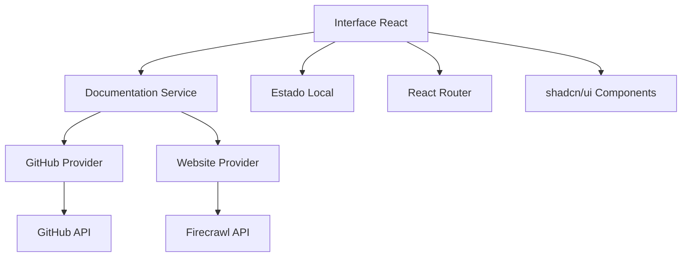
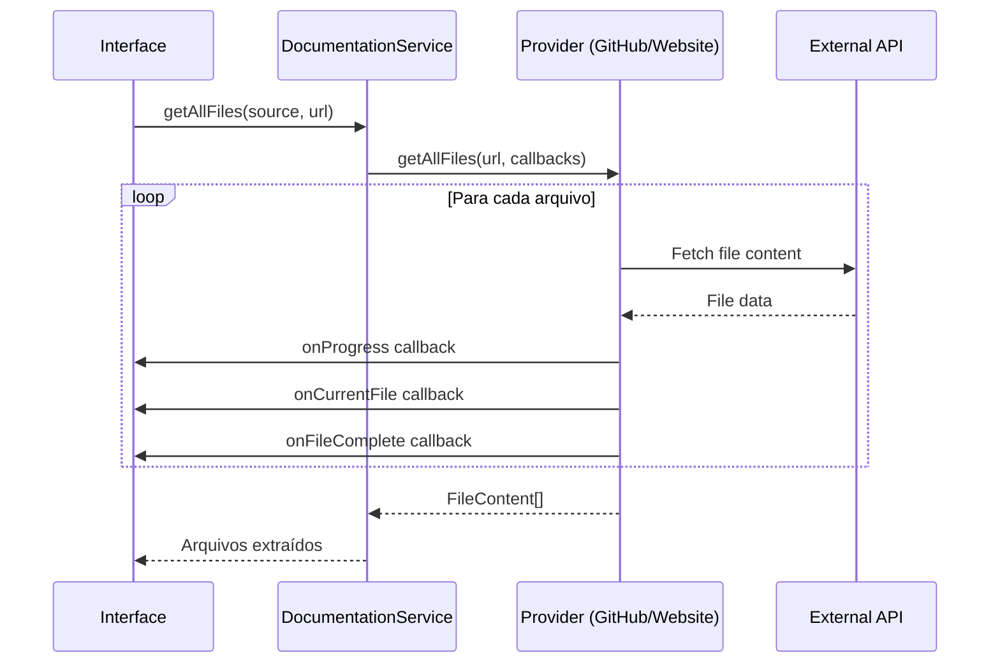
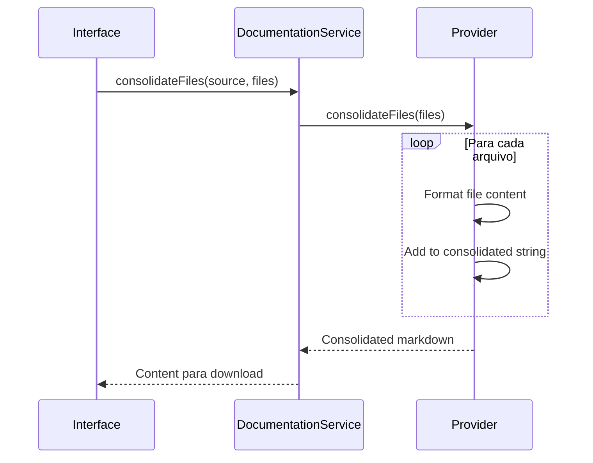

# Arquitetura do Docs Consolidator

Esta documentação detalha a arquitetura técnica do projeto, padrões de código e decisões arquiteturais.

## 🏗 Visão Geral da Arquitetura

O Docs Consolidator segue uma arquitetura **React moderna** com **separação clara de responsabilidades** e **padrões escaláveis**.



## 📁 Estrutura de Diretórios

```
src/
├── components/              # Componentes React
│   ├── ui/                 # shadcn/ui base components
│   │   ├── button.tsx      # Componente Button
│   │   ├── card.tsx        # Componente Card
│   │   └── ...            # Outros componentes UI
│   ├── DocumentationTabs.tsx  # Tabs para seleção de fonte
│   ├── FilesList.tsx          # Lista de arquivos
│   ├── GitHubInput.tsx        # Input para GitHub
│   ├── WebsiteInput.tsx       # Input para Website
│   └── ProgressViewer.tsx     # Visualizador de progresso
├── services/               # Camada de serviços
│   ├── providers/         # Implementações específicas
│   │   ├── GitHubProvider.ts    # Provider para GitHub
│   │   └── WebsiteProvider.ts   # Provider para Firecrawl
│   └── DocumentationService.ts # Orquestrador principal
├── types/                 # Definições TypeScript
│   └── documentation.ts   # Types para documentação
├── hooks/                 # Custom React hooks
│   ├── use-mobile.tsx     # Hook para detecção mobile
│   └── use-toast.ts       # Hook para toast notifications
├── pages/                 # Páginas da aplicação
│   ├── Index.tsx          # Página principal
│   └── NotFound.tsx       # Página 404
├── lib/                   # Utilitários e helpers
│   └── utils.ts           # Funções utilitárias
└── assets/                # Recursos estáticos
```

## 🎯 Padrões Arquiteturais

### 1. Service Layer Pattern

O projeto utiliza um **Service Layer** para abstrair a lógica de negócio da UI:

```typescript
// DocumentationService.ts - Orquestrador principal
export class DocumentationService {
  private static providers: Map<DocumentationSource, DocumentationProvider>;
  
  static async getAllFiles(source: DocumentationSource, url: string): Promise<FileContent[]> {
    const provider = this.getProvider(source);
    return provider.getAllFiles(url);
  }
}
```

### 2. Provider Pattern

Cada fonte de dados tem seu próprio **Provider** que implementa a interface comum:

```typescript
// types/documentation.ts
export interface DocumentationProvider {
  getAllFiles(url: string, callbacks?: ProgressCallback): Promise<FileContent[]>;
  consolidateFiles(files: FileContent[]): string;
  downloadFile(content: string, filename: string): void;
}

// providers/GitHubProvider.ts
export class GitHubProvider implements DocumentationProvider {
  async getAllFiles(url: string): Promise<FileContent[]> {
    // Implementação específica para GitHub
  }
}
```

### 3. Strategy Pattern

O **DocumentationService** usa Strategy Pattern para selecionar o provider correto:

```typescript
static detectSource(url: string): DocumentationSource {
  if (url.includes('github.com')) {
    return 'github';
  }
  return 'website';
}
```

## 🔧 Componentes Principais

### DocumentationService (Orquestrador)

**Responsabilidades:**
- Gerenciar providers
- Orquestrar operações de extração
- Consolidar arquivos
- Detectar fonte automaticamente

```typescript
export class DocumentationService {
  // Registry de providers
  private static providers: Map<DocumentationSource, DocumentationProvider>;
  
  // Factory method para providers
  static getProvider(source: DocumentationSource): DocumentationProvider;
  
  // Operações principais
  static async getAllFiles(...): Promise<FileContent[]>;
  static consolidateFiles(...): string;
  static downloadFile(...): void;
}
```

### Providers (Implementações Específicas)

#### GitHubProvider
- **API**: GitHub REST API v4
- **Funcionalidades**: 
  - Extração de estrutura de diretórios
  - Download de conteúdo de arquivos
  - Filtragem por extensões relevantes
  - Rate limiting awareness

#### WebsiteProvider  
- **API**: Firecrawl REST API
- **Funcionalidades**:
  - Scraping de conteúdo web
  - Conversão para markdown
  - Gerenciamento de API keys
  - Tratamento de erros específicos

### Componentes de UI

#### DocumentationTabs
- **Responsabilidade**: Seleção entre GitHub e Website
- **Estado**: Controla abas ativas
- **Props**: Callbacks para submit e loading state

#### FilesList
- **Responsabilidade**: Exibir arquivos extraídos
- **Funcionalidades**: 
  - Lista paginada de arquivos
  - Botões de ação (consolidar, download)
  - Estados de loading

#### ProgressViewer
- **Responsabilidade**: Mostrar progresso da extração
- **Features**:
  - Barra de progresso global
  - Lista de arquivos sendo processados
  - Estados por arquivo (pending, processing, completed, error)

## 🔄 Fluxo de Dados

### 1. Extração de Arquivos



### 2. Consolidação



## 📦 Gerenciamento de Estado

### Estado Local (useState)

```typescript
// Index.tsx - Estado principal da aplicação
const [files, setFiles] = useState<FileItem[]>([]);           // Arquivos extraídos
const [loading, setLoading] = useState(false);               // Loading state
const [consolidating, setConsolidating] = useState(false);   // Consolidação state
const [progress, setProgress] = useState(0);                 // Progresso %
const [progressFiles, setProgressFiles] = useState<ProgressItem[]>([]); // Files em progresso
```

### Gerenciamento de Side Effects (useEffect)

- **Callbacks de progresso**: Atualizações em tempo real durante extração
- **Toast notifications**: Feedback para usuário
- **Cleanup**: Limpeza de estado entre operações

## 🌐 Integração com APIs

### GitHub API

```typescript
// Estrutura das requisições
const apiUrl = `https://api.github.com/repos/${owner}/${repo}/contents/${path}`;

// Headers padrão
const headers = {
  'Accept': 'application/vnd.github.v3+json',
  'User-Agent': 'Docs-Consolidator'
};

// Rate limiting
if (response.headers.get('X-RateLimit-Remaining') === '0') {
  // Handle rate limit
}
```

### Firecrawl API

```typescript
// Configuração
const FIRECRAWL_API_URL = 'https://api.firecrawl.dev/v0/scrape';

// Payload da requisição
const payload = {
  url: targetUrl,
  formats: ['markdown'],
  onlyMainContent: true
};

// Headers com API key
const headers = {
  'Authorization': `Bearer ${apiKey}`,
  'Content-Type': 'application/json'
};
```

## 🎨 Sistema de Design

### Tokens de Design (index.css)

```css
:root {
  /* Cores principais */
  --background: 0 0% 100%;
  --foreground: 222.2 84% 4.9%;
  --primary: 222.2 47.4% 11.2%;
  
  /* Gradientes */
  --gradient-primary: linear-gradient(135deg, hsl(var(--primary)), hsl(var(--primary-glow)));
  
  /* Sombras */
  --shadow-glow: 0 0 40px hsl(var(--primary-glow) / 0.4);
}
```

### Componentes Base (shadcn/ui)

- **Configuração**: `components.json`
- **Customização**: Via CSS variables
- **Variants**: Usando `class-variance-authority`

## 🔐 Tratamento de Erros

### Estratégia de Error Handling

```typescript
// Service layer
try {
  const result = await provider.getAllFiles(url);
  return result;
} catch (error) {
  console.error('Service error:', error);
  throw new Error(`Falha na extração: ${error.message}`);
}

// UI layer
catch (error) {
  toast({
    title: "Erro",
    description: error instanceof Error ? error.message : "Erro desconhecido",
    variant: "destructive",
  });
}
```

### Tipos de Erro

1. **Network errors**: Falhas de conectividade
2. **API errors**: Erros das APIs externas
3. **Validation errors**: Dados inválidos
4. **Rate limiting**: Excesso de requisições

## ⚡ Performance

### Otimizações Implementadas

1. **Lazy loading**: Componentes carregados sob demanda
2. **Memoization**: `useMemo` para cálculos custosos
3. **Debouncing**: Em inputs de usuário
4. **Progress callbacks**: Updates incrementais de UI
5. **Error boundaries**: Isolamento de falhas

### Métricas de Performance

- **Time to Interactive**: < 2s
- **Bundle size**: Otimizado com tree-shaking
- **Memory usage**: Garbage collection adequado

## 🧪 Testabilidade

### Estrutura para Testes

```typescript
// Mocks para providers
const mockGitHubProvider = {
  getAllFiles: jest.fn(),
  consolidateFiles: jest.fn(),
  downloadFile: jest.fn()
};

// Testes de integração
describe('DocumentationService', () => {
  it('should extract files from GitHub', async () => {
    // Test implementation
  });
});
```

## 🚀 Escalabilidade

### Pontos de Extensão

1. **Novos Providers**: Implementar `DocumentationProvider`
2. **Novos Formatos**: Estender `consolidateFiles`
3. **Novas UI**: Componentes modulares
4. **Novos Filters**: Sistema de filtros extensível

### Padrões de Crescimento

- **Horizontal**: Adicionar novos providers
- **Vertical**: Melhorar providers existentes
- **Funcional**: Novas features (filtros, exports, etc.)

## 📚 Referências Técnicas

- [React Patterns](https://reactpatterns.com/)
- [TypeScript Best Practices](https://typescript-eslint.io/rules/)
- [GitHub API Documentation](https://docs.github.com/en/rest)
- [Firecrawl API Documentation](https://docs.firecrawl.dev/)
- [shadcn/ui Documentation](https://ui.shadcn.com/)